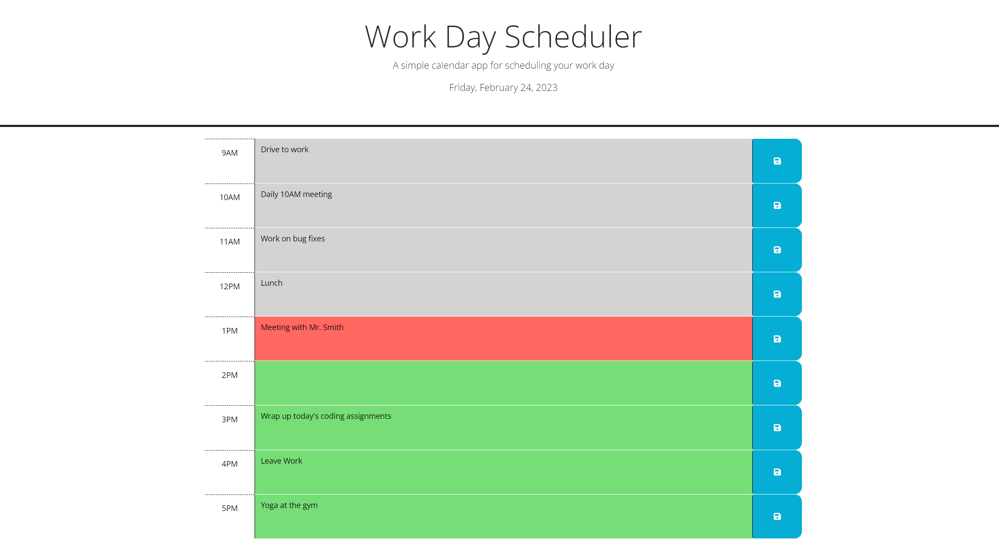

# jQuery-Day-Planner

## Description

A work day scheduler powered by jQuery. The calendar's visuals update based on the time of day, and users can enter and save events in any of the hour boxes.

## Screenshot

## Usage

Click on one of the hour boxes to enter in an event for your planner. Press the button on the right side to save the event.

## Credits

N/A

## Link

https://nnamdionyeije.github.io/jQuery-Day-Planner/
